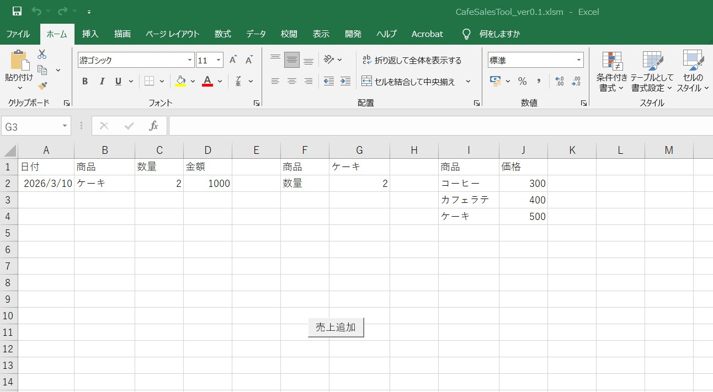

# cafe-sales-tool
VBAで作ったカフェの売上管理ツールです。

## 使い方v
G,1プルダウンで商品を選択。 
G,2には数量を入れてください。 
合計を算出します。 

## スクリーンショット

## 機能
・商品入力 
・数量入力 
・合計計算 
・商品別売上 

## 使用技術
・Excel 
・VBA 
## バージョン
ver0.1 
数量×単価 
ver0.2 
商品マスタ  
ver0.3  
商品をプルダウン 
ver0.4  
入力チェック  
ver0.5 
入力クリア 
ver0.6 
売上合計 
ver0.7 
商品別売上 
ver0.8 
売上グラフ 
